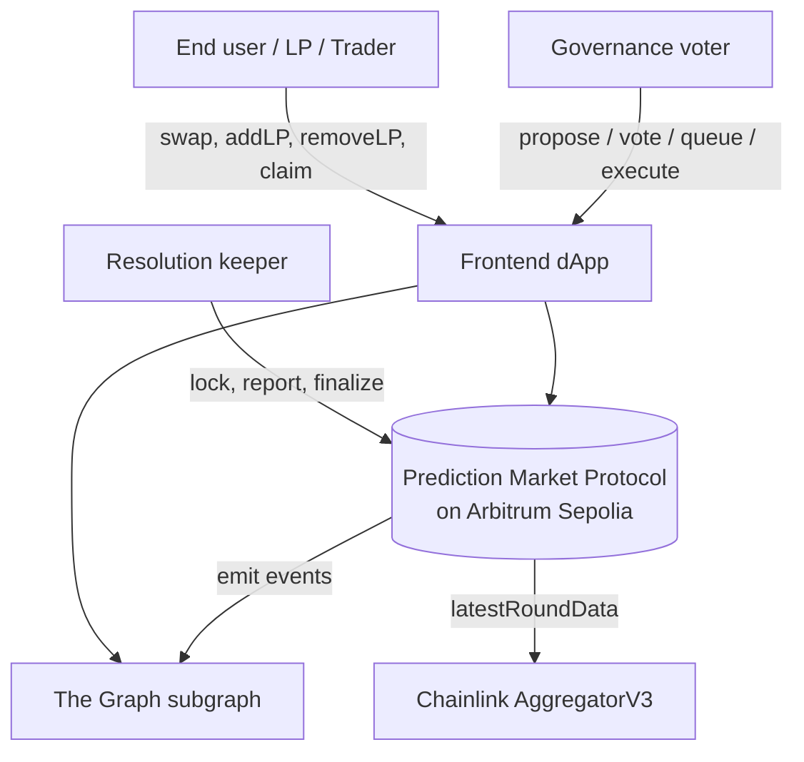
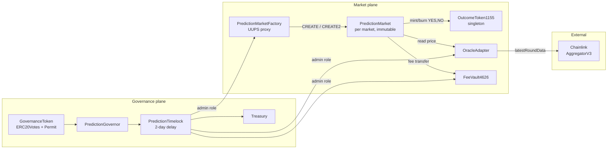
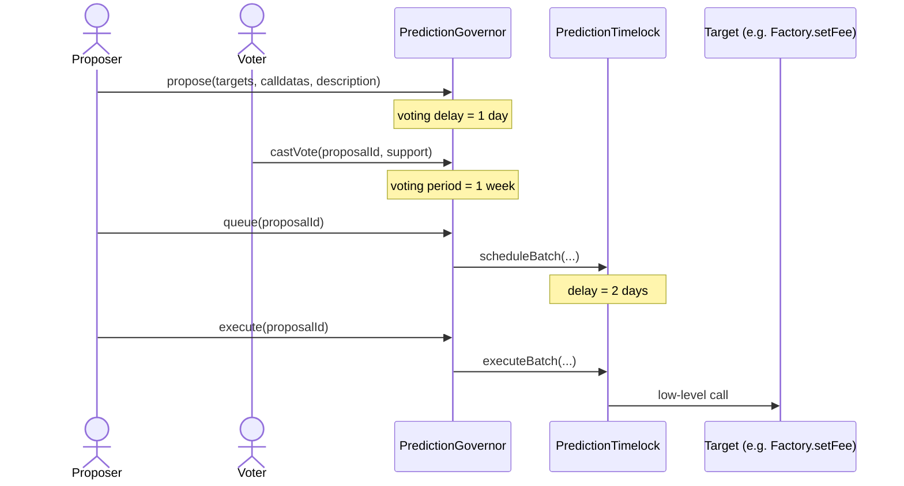

# Architecture — On-Chain Prediction Market

**Status:** v0.1 (W6 baseline)
**Authors:** Evelina (core), Daniyar (governance/audit), Teammate 3 (frontend/devops)
**Scope of this document:** the full protocol, not only the W6 deliverables.

---

## 1. System context (C4 — Level 1)



The protocol is self-contained on a single L2. External dependencies are
**Chainlink** (price/data feeds) and **The Graph** (read-only indexing).
There is no off-chain backend in the trust path.

## 2. Component diagram (C4 — Level 2)



### 2.1 Roles & access control

| Role                                  | Holder                | Powers                                                                 |
|---------------------------------------|-----------------------|------------------------------------------------------------------------|
| `DEFAULT_ADMIN_ROLE` (Factory + Vault + Oracle) | `PredictionTimelock` | Grant/revoke other roles, set protocol parameters                |
| `PROPOSER_ROLE` (Timelock)            | `PredictionGovernor`  | Queue executions                                                       |
| `EXECUTOR_ROLE` (Timelock)            | `address(0)` (open)   | Execute queued operations after delay                                  |
| `CANCELLER_ROLE` (Timelock)           | Multisig (W9)         | Emergency cancel of queued proposals                                   |
| `KEEPER_ROLE` (Market)                | EOA / Chainlink Automation | Call `lockMarket`, `reportOutcome`, `finalize` (only state transitions, no value extraction) |
| `PAUSER_ROLE` (Market)                | `PredictionTimelock`  | Pause swaps/LP in emergency                                            |
| `MARKET_MINTER_ROLE` (OutcomeToken1155) | per-market `PredictionMarket` instances | Mint/burn YES/NO ids for that specific market           |

**No EOA owns any privileged role at steady state.** All admin power is
mediated by the 2-day Timelock, which itself is controlled by the on-chain
Governor. See §6 (Trust assumptions).

## 3. Contract responsibilities

### 3.1 `PredictionMarket` (per-market, non-upgradeable)

A single market is one binary question (e.g. "BTC/USD ≥ $100k on
2026-12-31 UTC"). Each instance:

- holds reserves of YES (id = `2 * marketId`) and NO (id = `2 * marketId + 1`) shares;
- is the only `MARKET_MINTER` of those two token ids on the singleton ERC-1155;
- implements a constant-product (`x · y = k`) AMM with a **0.3% LP fee**;
- maintains an internal ERC-20 LP token (`PLP`);
- transitions through a state machine (§4);
- redeems winning shares 1:1 for collateral after finalisation, **pull-style**.

Markets are deliberately **non-upgradeable** so traders are guaranteed the
rules don't change underneath them once they buy in.

### 3.2 `PredictionMarketFactory` (UUPS upgradeable)

The factory is the only contract that can create new markets. It:

- deploys markets via `CREATE` (`createMarket`) and via `CREATE2`
  (`createMarketDeterministic`), letting integrators pre-compute the address;
- holds a registry `marketId → marketAddress` plus the reverse mapping;
- grants the new market the `MARKET_MINTER_ROLE` on the singleton ERC-1155
  immediately after deploy;
- uses **ERC-7201 namespaced storage** to make storage collisions impossible
  across V1 → V2 upgrades (§5);
- is owned by the Timelock; upgrades require a governance proposal.

The factory is also the natural place for inline Yul: `predictMarketAddress`
computes the CREATE2 address (`keccak256(0xff ‖ factory ‖ salt ‖ keccak256(initCode))`)
in 5 lines of Yul that we benchmark against a pure-Solidity equivalent in W7.

### 3.3 `OutcomeToken1155`

ERC-1155 singleton. Token IDs are derived deterministically from the
market id, so no on-chain mapping is needed:

```
yesId(marketId) = marketId * 2
noId (marketId) = marketId * 2 + 1
```

Mint/burn for a given id is gated by `MARKET_MINTER_ROLE`, and the role is
granted only to the market that owns that id. Other markets cannot mint
into someone else's id range.

### 3.4 `OracleAdapter` (W8)

Wraps a Chainlink `AggregatorV3Interface`. Reverts if the reported price is
older than `STALENESS_THRESHOLD` (configurable per feed, governance-controlled).
Exposes:

- `latestSafePrice(feed)` — reverts on stale / negative / zero-round data;
- `resolveBinary(market, threshold)` — returns `0` (YES) or `1` (NO) based
  on the comparison;
- a **dispute window** (default 24h) during which `disputeOutcome` may be
  invoked by governance, blocking finalisation.

### 3.5 `FeeVault4626` (W8)

ERC-4626 vault denominated in the protocol's collateral token. LP fees
collected from `PredictionMarket` instances flow here. Shares are
non-rebasing; yield accrues as `convertToAssets` grows. We ship the
standard OZ ERC-4626 plus an explicit set of rounding invariants:

```
previewDeposit(x) ≤ deposit(x)     // user can never get more shares than the preview
previewMint(s)   ≥ mint(s)         // user always pays at least the previewed assets
previewWithdraw(a)≥ withdraw(a)    // shares burnt cannot be lower than preview
previewRedeem(s) ≤ redeem(s)       // assets returned cannot exceed preview
```

These invariants will be enforced via Foundry invariant tests in W8.

### 3.6 Governance plane (W9)

- `GovernanceToken` — `ERC20 + ERC20Votes + ERC20Permit`, fixed cap of 100M.
- `PredictionGovernor` — `Governor + GovernorSettings + GovernorCountingSimple
  + GovernorVotes + GovernorVotesQuorumFraction + GovernorTimelockControl`.
  - voting delay: **1 day** (`7200 blocks` on Arbitrum; we use `block.number`
    via the standard OZ clock unless we switch to `timestamp` mode);
  - voting period: **1 week**;
  - quorum: **4% of total supply**;
  - proposal threshold: **1% of total supply**.
- `PredictionTimelock` — `TimelockController`, minDelay = **2 days**.

Scope of governance: market creation parameters (fees, dispute window),
oracle whitelist, vault parameters, and treasury spending. The Governor
**cannot** rewrite an in-flight market's outcome — only resolve a dispute
within the dispute window via the standard adapter call.

## 4. Market lifecycle (state machine)

```
                          ┌─────────────────────────────────────────────┐
                          │                  Open                       │  default after deploy
                          │  addLiquidity, removeLiquidity, swap, mint/redeem complete sets │
                          └───────────────┬─────────────────────────────┘
                                          │ block.timestamp ≥ tradingEndsAt && lockMarket()
                                          ▼
                          ┌─────────────────────────────────────────────┐
                          │                 Locked                      │  no trading; LP can still removeLiquidity
                          └───────────────┬─────────────────────────────┘
                                          │ reportOutcome() via OracleAdapter
                                          ▼
                          ┌─────────────────────────────────────────────┐
                          │                Reported                     │  dispute window open
                          └─────┬────────────────────────┬──────────────┘
        disputeOutcome() via DAO │                        │ block.timestamp ≥ disputeEndsAt && finalize()
                                 ▼                        ▼
                  ┌──────────────────────┐    ┌─────────────────────────┐
                  │      Disputed        │    │       Finalized         │
                  │  governance decides  │    │  claimWinnings() open   │
                  └──────┬───────────────┘    └─────────────────────────┘
                         │ resolveDispute(outcome) by Timelock
                         ▼
                  (transitions to Finalized)
```

`Invalid` is a side state (reachable from `Reported` or `Disputed`) that
allows redemption of complete sets 1:1 (i.e. cancels the market).

## 5. Storage layout

### 5.1 `PredictionMarket` (non-upgradeable, slot-explicit)

| Slot | Field                          | Type                  | Notes                            |
|------|--------------------------------|-----------------------|----------------------------------|
| 0    | `_balances` (ERC-20 LP)        | mapping(address ⇒ uint256) | inherited from OZ ERC-20    |
| 1    | `_allowances` (ERC-20 LP)      | mapping(address ⇒ mapping(address ⇒ uint256)) |     |
| 2    | `_totalSupply` (LP)            | uint256               |                                  |
| 3    | `_name` (LP)                   | string                |                                  |
| 4    | `_paused`                      | bool                  | from Pausable                    |
| 5    | `_status` (ReentrancyGuard)    | uint256               |                                  |
| 6    | `_roles`                       | mapping               | from AccessControl               |
| 7    | `reserveYes`                   | uint128 + uint128 packed with `reserveNo` | packed slot   |
| 8    | `tradingEndsAt` (uint64) `‖ disputeEndsAt` (uint64) `‖ status` (uint8) `‖ winningOutcome` (uint8) | packed | single slot |
| 9    | `marketId`                     | uint64                | immutable-style (set in constructor) |
| 10   | `feeBps`                       | uint16                |                                  |
| 11   | `claimed[address]`             | mapping(address ⇒ uint256) | for pull-style claim tracking |
| —    | `collateralToken`              | `IERC20`              | **immutable** (no slot)          |
| —    | `outcomeToken`                 | `IOutcomeToken1155`   | **immutable**                    |
| —    | `oracleAdapter`                | `IOracleAdapter`      | **immutable**                    |
| —    | `feeVault`                     | address               | **immutable**                    |
| —    | `questionId`                   | bytes32               | **immutable**                    |

Markets are **not upgradeable**; this table exists for review, not for collision proofs.

### 5.2 `PredictionMarketFactory` (UUPS — ERC-7201 namespaced storage)

```solidity
/// @custom:storage-location erc7201:prediction.market.factory.main
struct FactoryStorage {
    address oracleAdapter;          // adapter wrapping Chainlink
    address feeVault;               // ERC-4626 fee receiver
    address outcomeToken;           // singleton ERC-1155
    address collateralToken;        // e.g. USDC
    uint64  nextMarketId;
    uint16  defaultFeeBps;
    uint32  defaultDisputeWindow;   // seconds
    mapping(uint64 => address) marketById;
    mapping(address => uint64) idByMarket;
}

// keccak256(abi.encode(uint256(keccak256("prediction.market.factory.main")) - 1)) & ~bytes32(uint256(0xff))
bytes32 constant FACTORY_STORAGE_SLOT =
    0x8a6eeb15c0a4f6f1bc393fbd6de59958b6281e71cb4379c188e2764f21c90200;
```

Because this contract is upgradeable, **no other storage variables** appear
at fixed slots — the `_authorizeUpgrade` check + namespaced storage make
V1 → V2 upgrades collision-proof. The V1 → V2 path is documented in ADR-002
(`docs/adr/ADR-002-uups-target-selection.md`).

## 6. Trust assumptions

- **Timelock is honest.** The 2-day delay gives token-holders a chance to
  exit or fork before a malicious upgrade can land. Without this assumption,
  a flash-loan governance attack could pass any proposal — see audit §8
  (Governance attack analysis) in W10.
- **Chainlink reports an unmanipulated price within `STALENESS_THRESHOLD`.**
  If the feed depegs or stalls, `reportOutcome` reverts and the market
  enters the dispute branch.
- **OutcomeToken1155 is correctly granted role only to authorised markets.**
  Tested via invariant: no two contracts share `MARKET_MINTER_ROLE` over
  the same id.
- **No EOA admin remains after deploy.** The post-deploy verification
  script (`script/Verify.s.sol`, W10) asserts this and is shipped as part
  of the submission.

## 7. Design patterns in use (≥5 required)

| Pattern                       | Where                                                                                | Justification                                                |
|-------------------------------|--------------------------------------------------------------------------------------|--------------------------------------------------------------|
| **Factory**                   | `PredictionMarketFactory`                                                            | Each market is a fresh contract; CREATE2 enables pre-computation for UX. |
| **Proxy / UUPS**              | `PredictionMarketFactory`                                                            | Market-creation logic may evolve (e.g. add new oracle types) without re-deploying markets. |
| **Checks-Effects-Interactions** | All externally callable functions in `PredictionMarket`                            | Defends against reentrancy via state mutation discipline.    |
| **Reentrancy Guard**          | `swap`, `addLiquidity`, `removeLiquidity`, `claimWinnings`                           | Belt-and-braces with CEI — ERC-1155 callbacks reach into user-controlled code. |
| **Access Control**            | All admin-only entry points                                                          | No `onlyOwner` — role-based, Timelock-rooted.                |
| **Pausable / Circuit Breaker**| `PredictionMarket` (Timelock-controlled)                                             | Emergency freeze if Chainlink halts.                         |
| **State Machine**             | `PredictionMarket` lifecycle                                                         | Different invariants per state; prevents e.g. trading after lock. |
| **Pull-over-push**            | `claimWinnings`, `removeLiquidity` (no auto-distribution)                            | Winning user always initiates the transfer; isolates failures. |
| **Oracle adapter**            | `OracleAdapter` wraps Chainlink                                                      | Lets us swap feeds (or use the mock in tests) without touching the market. |
| **Timelock**                  | `PredictionTimelock`                                                                 | All privileged actions delayed by 2 days — mandatory governance lag. |

We claim **10 / 10** of the listed patterns; spec requires ≥ 5. Every claim
is backed by a code reference (see audit report cross-references in W10).

## 8. Sequence diagrams (3 critical flows)

### 8.1 Swap (buy YES with collateral via complete-set mint + AMM)

```mermaid
sequenceDiagram
    actor Trader
    participant PM as PredictionMarket
    participant OT as OutcomeToken1155
    participant Coll as ERC-20 Collateral

    Trader->>PM: buyOutcome(YES, C, minOut, deadline)
    PM->>PM: require state == Open, block.timestamp ≤ deadline
    PM->>Coll: safeTransferFrom(trader, this, C)
    PM->>OT: mint(this, yesId, C); mint(this, noId, C)
    PM->>PM: (Effects) update reserves: R_N += C, R_Y += C - yesOut
    Note over PM: yesOut = C + (C·997·R_Y) / (R_N·1000 + C·997)
    PM->>PM: require yesOut ≥ minOut
    PM->>OT: safeTransferFrom(this, trader, yesId, C + swapYesOut)
    PM-->>Trader: event Swap(...)
```

### 8.2 Propose → Vote → Queue → Execute (governance lifecycle)



### 8.3 Resolve (lock → report → finalise / dispute)

```mermaid
sequenceDiagram
    participant Keeper
    participant PM as PredictionMarket
    participant OA as OracleAdapter
    participant CL as Chainlink Aggregator
    participant DAO as Governor + Timelock

    Keeper->>PM: lockMarket()
    PM->>PM: require block.timestamp ≥ tradingEndsAt; status = Locked
    Keeper->>PM: reportOutcome()
    PM->>OA: resolveBinary(questionId, threshold)
    OA->>CL: latestRoundData()
    OA-->>PM: outcome (YES | NO)
    PM->>PM: status = Reported; disputeEndsAt = now + window
    alt Within dispute window
        DAO->>PM: disputeOutcome()
        PM->>PM: status = Disputed
        DAO->>PM: resolveDispute(finalOutcome)
        PM->>PM: status = Finalized
    else After dispute window
        Keeper->>PM: finalize()
        PM->>PM: status = Finalized
    end
```

## 9. ADRs (Architecture Decision Records)

Stored under `docs/adr/`. Initial set:

- **ADR-001 — Choosing CPMM (x · y = k) over LMSR for binary outcomes.**
  CPMM is easier to audit, has no bounded-loss subsidy requirement, and
  reuses well-understood Uniswap-style invariant tests. LMSR would have
  given better price discovery in thin markets but required `exp`/`ln` math
  with bespoke fixed-point libraries — auditing those is a sub-project on
  its own.
- **ADR-002 — UUPS on the Factory, not on the Market.** Markets are
  immutable for trader safety; the factory holds the upgradeable mutable
  state (default fees, oracle whitelist, etc.).
- ADR-003+ to be added through W7–W10 as decisions arise.

## 10. Out-of-scope (this baseline)

- Frontend dApp (W9)
- Subgraph schema (W9)
- Slither output (W10)
- Gas report (W10)

---

> This document is reviewed at the end of each weekly milestone. Diffs are
> captured in commit messages of the form `docs(arch): <change>`.
